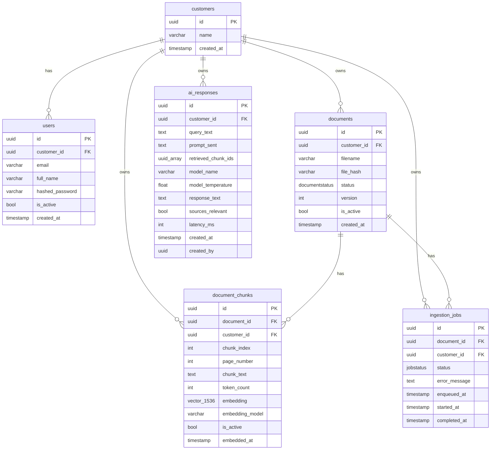

# SOP Assistant — AI Backend Service

A multi-tenant AI backend for analysing Standard Operating Procedures (SOPs).
Designed for regulated industries (healthcare, legal, pharmaceuticals) where
**hallucination and data leakage are unacceptable**.

Users upload PDF SOPs; the system chunks and embeds them; natural-language
questions are answered with cited, fully auditable AI responses that reference
only the customer's own documents.

---

## Table of Contents

1. [What the system does](#what-the-system-does)
2. [Features](#features)
3. [Assumptions](#assumptions)
4. [Architecture](#architecture)
5. [Design decisions](#design-decisions)
6. [Trade-offs](#trade-offs)
7. [How to run locally](#how-to-run-locally)
8. [API reference](#api-reference)
9. [Example audit response](#example-audit-response)

---

## What the system does

```
Upload PDF  →  Worker parses, chunks, embeds  →  Stored in pgvector
Ask question  →  Query embedded, top-k chunks retrieved, prompt built  →  Claude answers
Every response  →  Full audit record stored (prompt verbatim, chunk IDs, latency, model params)
```

Key properties:

- **Multi-tenant** — every query and every vector search is scoped to a single
  `customer_id` extracted from the JWT (never from request input). A customer can
  never read another tenant's data, enforced at three independent layers: JWT
  extraction, application-level `customer_id` filter on every query, and a
  RESTRICTIVE Row-Level Security policy on `document_chunks`.
- **Auditable** — the exact prompt sent to the LLM, the precise chunk IDs used
  as context, the model name, temperature, and response latency are all stored
  permanently and queryable via `GET /api/v1/sop/responses/{id}`.
- **Deterministic** — `temperature=0` on all LLM calls. The same question on the
  same corpus always produces the same answer, which is required for regulated
  environments.
- **Source-cited** — every response includes a `sources` array that maps each
  claim back to the exact SOP chunk it came from.

---

## Features

- **PDF upload and async ingestion** — upload a PDF; the API returns immediately with a `job_id`; the worker parses, chunks, and embeds in the background.
- **Semantic search scoped to each customer** — every pgvector search is filtered by `customer_id` from the JWT; tenants are fully isolated at both the application and database layers.
- **AI-generated answers with cited sources** — each response includes the referenced SOP filename and page number for every retrieved chunk.
- **Full audit trail** — the exact prompt, retrieved chunk IDs, model name, temperature, and latency are stored permanently in `ai_responses` and queryable via the API.
- **LLM self-reports source relevance** — the prompt instructs the model to emit a `SOURCES_USED: true/false` marker; the backend parses and strips it, storing the value as `sources_relevant` so the UI knows whether to display source chips.
- **B2B auth with per-user JWT** — users authenticate with email + password; the signed JWT carries both `user_id` and `customer_id`; `customer_id` is never accepted from request input.
- **Dark/light mode UI** — React + Tailwind frontend with a toggle that persists across sessions, accessible at `http://localhost:5173`.

---

## Assumptions

| # | Assumption |
|---|---|
| 1 | A **customer** is the tenant unit. Users belong to customers — every JWT contains both `user_id` and `customer_id`. Tenant isolation is enforced server-side via `customer_id`; user identity is available for per-user audit trails. |
| 2 | **PDF** is the only supported document format. Other formats (DOCX, HTML) are out of scope. |
| 3 | Uploaded PDFs contain machine-readable text. Scanned image-only PDFs will produce empty text and fail ingestion gracefully with a descriptive error. |
| 4 | File size is capped at **10 MB** per upload. Larger SOPs should be split before upload. |
| 5 | The embedding model (`text-embedding-3-small`) is fixed for the lifetime of the vector store. Changing models requires re-ingesting all documents. |
| 6 | Query volume is in the order of **~1 000 requests/day** — synchronous LLM calls within the HTTP request cycle are acceptable at this scale. |
| 7 | SOPs are primarily in **English**. The `cl100k_base` tiktoken encoding used for chunking is optimised for English and closely related languages. |
| 8 | The `customers` table exists for data integrity (foreign key anchor) but customer provisioning is out of scope for this service. |
| 9 | Deleted documents are **soft-deleted** (`is_active = false`). Hard deletes are not supported — audit records that reference those chunks must remain queryable. |

---

## Architecture

### Three-service design

```
┌─────────────────────────────────────────────┐
│  Service 1 — Frontend (Vite + React)         │
│  Docker container, port 5173                 │
│                                              │
│  Login → JWT stored in React state           │
│  Documents page — upload, poll job status   │
│  Chat page — query, source chips, dark mode │
└──────────────────┬──────────────────────────┘
                   │ HTTP (Bearer JWT)
┌──────────────────▼──────────────────────────┐
│  Service 2 — FastAPI API Server              │
│  Docker container, port 8000                 │
│                                              │
│  POST /api/v1/auth/login ──────────────────►│──► bcrypt verify → sign JWT (user_id + customer_id)
│  POST /api/v1/sop/ingest  ─────────────────►│──► writes Document + IngestionJob rows
│  GET  /api/v1/sop/ingest/jobs/{id}          │
│  POST /api/v1/sop/query   ─────────────────►│──► embed → pgvector search → Claude → AIResponse
│  GET  /api/v1/sop/responses/{id}            │
│  GET  /health                               │
└──────────────────┬──────────────────────────┘
                   │ Postgres (shared DB)
┌──────────────────▼──────────────────────────┐
│  Service 3 — Ingestion Worker               │
│  Docker container (same image as API)        │
│                                             │
│  while True:                                │
│    claim job (FOR UPDATE SKIP LOCKED)       │
│    parse PDF → page-by-page (pdfplumber)    │
│    chunk text (tiktoken, 512/50 tokens)     │
│    embed chunks (OpenAI, batches of 100)    │
│    store DocumentChunk rows + vectors       │
│    mark job completed                       │
└─────────────────────────────────────────────┘
```

All three services are started with a single `docker-compose up --build`. The API
and Worker share a Postgres database but **never share memory or communicate
directly**. The API process writes a job record; the worker polls for it. If the
worker crashes, the API continues serving queries. If the API crashes, queued jobs
are processed when it comes back.

### B2B auth layer

Authentication is user-scoped (not just tenant-scoped). The `users` table stores
bcrypt-hashed passwords and a foreign key to `customers`. On login, the API signs a
JWT containing both `user_id` and `customer_id`. All subsequent requests extract
`customer_id` from the JWT server-side — it is never accepted from request bodies or
query parameters.

### ER Diagram



### Tenant isolation — three independent layers

1. **Auth layer** — `customer_id` is extracted exclusively from the signed JWT by
   the `get_current_customer_id()` dependency. It is never accepted from the request
   body or query parameters. A forged or missing `customer_id` in the request is
   simply ignored.

2. **Application layer** — every SQL query and every pgvector search includes
   `WHERE customer_id = $1` with the JWT-derived value. This is enforced in every
   route and service function; there is no code path that reads across tenants.

3. **Database layer** — a `RESTRICTIVE` Row-Level Security policy on
   `document_chunks` uses `current_setting('app.current_customer_id', true)`.
   Even if a bug in the application layer omitted the filter, the DB would
   return zero rows for that tenant.

---

## Design decisions

### Async ingestion — separate worker process (not sync HTTP)

PDF parsing + chunking + batched OpenAI embedding calls take 10–60 seconds
per document. Blocking an HTTP worker thread for that duration would require
a very large thread pool and would degrade API responsiveness under load.

Instead: the API returns `202 Accepted` immediately with a `job_id`. The
worker process picks up the job asynchronously. The caller polls
`GET /api/v1/sop/ingest/jobs/{job_id}` to check completion. This decouples
upload throughput from embedding throughput.

### Postgres job queue — no Redis, no external broker

The `ingestion_jobs` table acts as a job queue using `SELECT … FOR UPDATE SKIP
LOCKED`. This is the PostgreSQL-idiomatic approach for reliable queue semantics
without adding operational complexity. There is no possibility of double-processing
a job, and the queue survives a worker crash (the job stays in `processing` state
until a timeout-based recovery is added).

Trade-off accepted: at high volume (>1 000 jobs/hour) a dedicated broker (SQS,
Redis+ARQ) would be preferable. At the assignment's target scale this is a
non-issue, and avoiding extra infrastructure is a real operational benefit.

### pgvector in the same Postgres instance — no separate vector DB

A dedicated vector database (Pinecone, Weaviate, Qdrant) adds an extra service
to operate, a second credential to manage, and requires keeping relational
metadata in sync with vectors. Since pgvector is mature and performant for tens
of millions of vectors, colocating vectors and relational data in Postgres
eliminates the sync problem entirely and simplifies tenant filtering to a plain
`WHERE customer_id = $1` clause.

### Chunking strategy — 512 tokens with 50-token overlap, paragraph-aware

Chunk size directly determines retrieval quality. Chunks that are too large
retrieve irrelevant sentences along with the relevant ones. Chunks that are too
small lose sentence context.

512 tokens is a well-established sweet spot for OpenAI's embedding models. The
50-token overlap prevents information loss at boundaries. Paragraph-aware splitting
(split on `\n\n` first, then token-limit) avoids cutting a sentence mid-thought.

### temperature=0 — deterministic LLM output

In regulated industries, an audit record is only meaningful if the same inputs
always produce the same output. `temperature=0` on all Anthropic API calls
ensures determinism. The stored `model_temperature` field in `ai_responses`
makes this explicit and machine-verifiable.

### Strict separation of DB models and API schemas

SQLModel `table=True` classes are the storage layer — they contain internal
fields (`file_hash`, `is_active`, `embedding`, `model_temperature`) that must
never be sent to API consumers. Separate Pydantic `BaseModel` classes in
`app/schemas/` are the deliberate public contract. This boundary is enforced in
every endpoint: the DB model is never returned directly.

### Soft delete everywhere

Documents and chunks are never hard-deleted. `is_active = false` hides them from
retrieval and dedup checks. This is required because `ai_responses.retrieved_chunk_ids`
references chunk UUIDs — if chunks were hard-deleted, audit records would have
dangling references and the `GET /api/v1/sop/responses/{id}` endpoint could not
reconstruct the source list.

---

## Trade-offs

| Decision | Choice made | Alternative | Reasoning |
|---|---|---|---|
| Vector DB | pgvector in Postgres | Pinecone, Weaviate | Simpler ops; tenant filter via SQL `WHERE`; no extra service to operate |
| Job queue | Postgres `FOR UPDATE SKIP LOCKED` | Redis + ARQ, SQS | No extra infrastructure; sufficient for ≤1k jobs/hour |
| Ingestion | Async worker process | Sync HTTP | PDFs take 10–60s to process; blocking HTTP is not viable |
| Query | Sync HTTP | SSE streaming | ~1k/day volume; sync is simpler and auditing is straightforward |
| Chunking | 512 tokens, 50 overlap | Document-level | Chunk-level retrieval gives far better precision for multi-section SOPs |
| LLM temperature | 0 | >0 | Determinism required for auditability in regulated domains |
| Tenant isolation | `customer_id` filter on every query + RLS policy on `document_chunks` + `customer_id` extracted from JWT only, never from request body | Separate DB per tenant | Cost-effective; enforced at three independent layers — auth, application, and database |
| DB / API models | Strictly separate | SQLModel dual-use | Clean boundary — DB internals (embeddings, file hashes) never leak to consumers |
| Source relevance | LLM-emitted `SOURCES_USED` marker | Score threshold / phrase matching | The LLM itself knows whether it answered from context; hardcoded thresholds are brittle and require ongoing tuning |
| File storage ⚠️ | Local disk (named Docker volume) | S3/GCS object storage | **Known limitation.** 200 PDFs × 5MB × 1000 customers ≈ 1TB; local disk cannot be shared across scaled API instances and has no redundancy. Production path: stream uploads to S3/GCS, store the key in the DB, worker downloads at processing time (~$23/month for 1TB on S3) |
| Context retention | Last 3 turns (6 messages) sent in prompt, full history stored in `ai_responses` as JSONB, turns linked via `conversation_id` | Full session history in prompt | Controls token cost per query; resolves pronouns and references across follow-up questions. Production enhancement: query rewriting step rewrites ambiguous follow-ups into standalone questions before retrieval, improving chunk recall. |
| Local development | `docker-compose up --build` (all services) | Running API, worker, frontend manually | Single command to start all three services eliminates environment drift and matches the production deployment model |

---

## How to run locally

### Prerequisites

- Docker and Docker Compose
- An OpenAI API key (for embeddings)
- An Anthropic API key (for LLM responses)

### 1. Clone and configure

```bash
git clone <repo-url>
cd sop-assistant

cp .env.example .env
# Edit .env and fill in:
#   OPENAI_API_KEY=sk-...
#   ANTHROPIC_API_KEY=sk-ant-...
#   JWT_SECRET=<any-strong-random-string>
```

### 2. Start all services

```bash
docker-compose up --build
```

This starts four containers: `db` (Postgres + pgvector), `api` (FastAPI on port 8000),
`worker` (ingestion worker), and `frontend` (Vite + React on port 5173).

### 3. Run migrations

```bash
# In a second terminal, once the db container is healthy:
docker-compose exec api alembic upgrade head
```

### 4. Seed test accounts

```bash
docker-compose exec api python scripts/seed.py
```

This creates two tenants with pre-hashed passwords, safe to run multiple times:

| Email | Password | Tenant |
|---|---|---|
| `alice@apollo.com` | `password123` | Apollo Hospitals |
| `bob@legalcorp.com` | `password123` | Legal Corp |

### 5. Open the UI

Navigate to **http://localhost:5173** and log in with either account above.

From the Documents page, upload a PDF SOP. The ingestion worker processes it in the
background (typically 15–45 seconds). Switch to the Chat page and ask questions about
your uploaded documents.

### API-only usage (curl)

```bash
# Login
curl -X POST http://localhost:8000/api/v1/auth/login \
  -H "Content-Type: application/json" \
  -d '{"email":"alice@apollo.com","password":"password123"}'
# → {"access_token": "eyJ...", "user_id": "...", "customer_id": "..."}

# Upload a PDF
curl -X POST http://localhost:8000/api/v1/sop/ingest \
  -H "Authorization: Bearer <token>" \
  -F "file=@/path/to/sop.pdf"
# → {"job_id": "...", "document_id": "...", "status": "queued"}

# Poll for completion
curl http://localhost:8000/api/v1/sop/ingest/jobs/<job_id> \
  -H "Authorization: Bearer <token>"
# → {"status": "completed", ...}

# Query
curl -X POST http://localhost:8000/api/v1/sop/query \
  -H "Authorization: Bearer <token>" \
  -H "Content-Type: application/json" \
  -d '{"query": "What is the protocol for medication handover in the ICU?"}'
```

Interactive API docs: **http://localhost:8000/docs**

---

## API reference

| Method | Path | Auth | Description |
|---|---|---|---|
| `GET` | `/health` | None | Liveness probe |
| `POST` | `/api/v1/auth/login` | None | Exchange email + password for a JWT (contains `user_id` + `customer_id`) |
| `POST` | `/api/v1/sop/ingest` | Bearer | Upload a PDF (max 10 MB); returns 202 |
| `GET` | `/api/v1/sop/ingest/jobs/{job_id}` | Bearer | Poll ingestion job status |
| `GET` | `/api/v1/sop/documents` | Bearer | List active documents for the authenticated customer |
| `POST` | `/api/v1/sop/query` | Bearer | Submit a RAG query; returns cited answer |
| `GET` | `/api/v1/sop/responses/{id}` | Bearer | Full audit record for a past response |

Interactive docs: `http://localhost:8000/docs`

---

## Example audit response

`GET /api/v1/sop/responses/3f2d9e1a-0000-0000-0000-000000000042`

```json
{
  "response_id": "3f2d9e1a-0000-0000-0000-000000000042",
  "answer": "Based on SOP-2021-ICU-Meds [Source 1], the medication handover protocol requires a double-check by two registered nurses before administering any high-alert drug. The administering nurse must verify the patient wristband, drug name, dose, route, and time against the electronic medication record [Source 2]. If any discrepancy is found, administration must be suspended and the charge nurse notified immediately.",
  "sources": [
    {
      "chunk_id": "a1b2c3d4-0000-0000-0000-000000000001",
      "document_filename": "SOP-2021-ICU-Meds.pdf",
      "chunk_index": 4,
      "relevance_score": 0.91
    },
    {
      "chunk_id": "a1b2c3d4-0000-0000-0000-000000000002",
      "document_filename": "SOP-2021-ICU-Meds.pdf",
      "chunk_index": 5,
      "relevance_score": 0.87
    }
  ],
  "model": "claude-sonnet-4-20250514",
  "generated_at": "2026-03-01T10:00:00.000000",
  "audit": {
    "prompt_sent": "System:\nYou are an AI assistant that analyzes Standard Operating Procedures (SOPs).\nUse ONLY the context provided below. Do not use any outside knowledge.\nIf the answer is not in the context, explicitly say so.\nAlways cite sources using [Source N] notation.\n\nContext:\n[Source 1 — SOP-2021-ICU-Meds.pdf, section 4]\nAll high-alert medications must be double-checked by two registered nurses prior to administration...\n\n[Source 2 — SOP-2021-ICU-Meds.pdf, section 5]\nThe administering nurse must verify the five rights against the electronic medication record...\n\nUser Query: What is the protocol for medication handover in the ICU?",
    "retrieved_chunk_ids": [
      "a1b2c3d4-0000-0000-0000-000000000001",
      "a1b2c3d4-0000-0000-0000-000000000002"
    ],
    "latency_ms": 1243,
    "model_temperature": 0.0
  }
}
```

Key auditability properties visible in this payload:

- **`prompt_sent`** is stored verbatim — a compliance officer can verify exactly
  what context the model was given and confirm no outside knowledge was injected.
- **`retrieved_chunk_ids`** links the response to exact rows in `document_chunks`,
  which in turn link to exact rows in `documents` — the evidence chain is complete.
- **`model_temperature: 0.0`** is machine-readable confirmation that the response
  was generated deterministically.
- **`latency_ms`** supports SLA monitoring without requiring external APM tooling.
